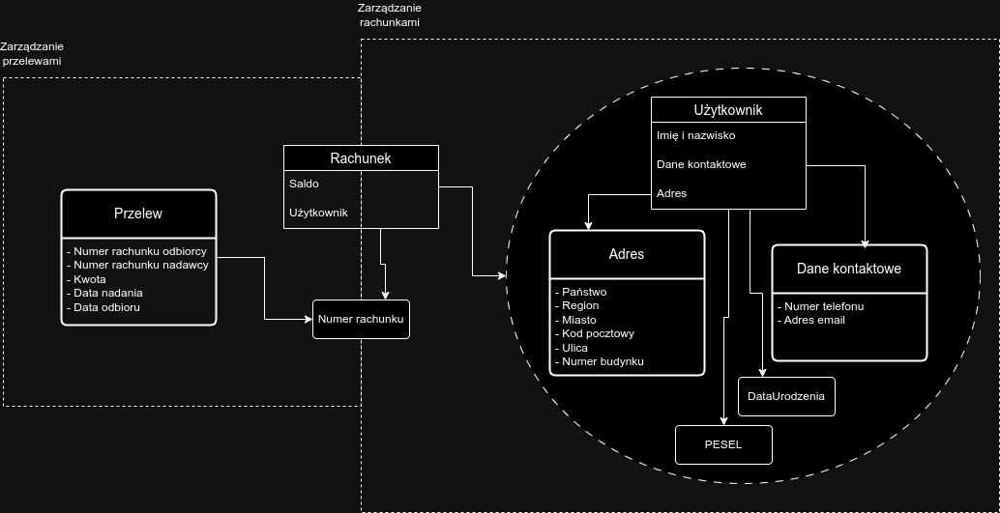

# Model Banku

Celem zadania jest przeprowadzenie uproszczonego procesu Domain Driven Design
dla wymyślonego banku. Stosujemy następujące słownictwo:

1. kontekst - bounded context
2. encja - entity
3. wartość - value object
4. agregat - aggregate
5. model - model 

Na początku zdefiniujemy konteksty, a następnie encje, wartości i agregaty.
Na końcu zamieścimy na diagramu modelu encje, wartości i agregaty w kontekstach,
oraz pokarzemy relacje między nimi.

W banku można wymienić następujące konteksty (bounded contexts):

1. Zarządzanie Rachunkami
2. Zarządzanie Przelewami

Oraz następujące encje, gdzie właściwości encji, które są wartościami oznaczono:

- Użytkownik
    - Imię i nazwisko ([\w .-]+)
    - PESEL (wartość) ([0-9A-Z]+)
    - Data urodzenia (wartość) ([0-9]{2}\.[0-9]{2}\.[0-9]{4})
    - Dane kontaktowe
    - Adres
- Dane kontaktowe (wartość)
    - Nr. telefonu ([0-9+]+) 
    - Adres email (weryfikator z biblioteki, w przybliżeniu: [a-zA-Z0-9]+@[a-zA-Z0-9.]+)
- Adres (wartość)
    - Państwo ([\w ]+)
    - Region ([\w ]+)
    - Miasto ([\w ]+)
    - Kod pocztowy ([0-9-]+)
    - Ulica ([\w ]+)
    - Numer budynku ([\w .]+)
- Rachunek
    - Numer rachunku (wartość) ([0-9]+)
    - Saldo
    - Użytkownik
- Przelew (wartość)
    - Numer rachunku odbiorcy (wartość) ([0-9]+)
    - Numer rachunku nadawcy (wartość) ([0-9]+)
    - Kwota (wartość) ([0-9.]+)
    - Data nadania (wartość) ([0-9]{2}\.[0-9]{2}\.[0-9]{4})
    - Data odbioru (wartość) ([0-9]{2}\.[0-9]{2}\.[0-9]{4})
- Karta debetowa
    - Użytkownik
    - Numer karty (wartość) ([0-9]+)
    - Pin ([0-9]+)
    - CVC (wartość) ([0-9]{3})

Poniżej przedstawiono diagram modelu:

